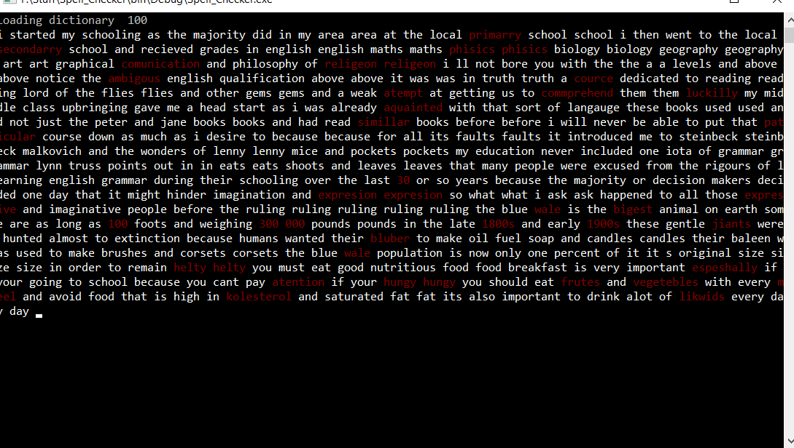

# Spell-Checker
> It is a spell checker implemented using bloom filters that highlights spelling mistakes. A file is taken as an input which is checked against the provided dictionary highlighting the words not present in the dictionary.
Feel free to propose improvements and generating pull requests.

## Interface

## How to Run
* In the folder Spell_Checker, there is a subfolder Spell_Checker which contains the exe file "Spell_Checker.exe". Double click on it to directly execute it.

*OR*
* Open this project in Visual Studio and re build it.

<B> Note: </B> By default it checks the spelling mistakes for the file named check.txt. To check your own file, modify the <b> readFile </b> function by changing "check.txt" to the name of your own file.

## Contributions
Your proposed improvements to the repository are most welcome.
* Feel free to fork the repository using the following link <https://github.com/Zaraahmad/Spell-Checker/fork>
* Commit your changes to the forked repository
* Submit pull request to the [Spell Checker Repository](https://github.com/Zaraahmad/Spell-Checker)

Also if you found it useful, please give it a star :D

## License
[MIT](../master/LICENSE)

## Author
[**Zara Ahmad**](https://github.com/Zaraahmad)

To stay updated with my GitHub Repositories follow me here on github: 

